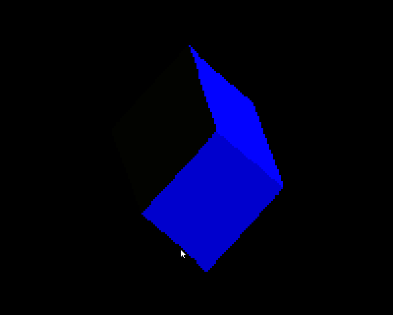
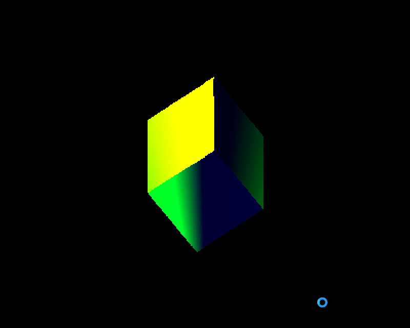
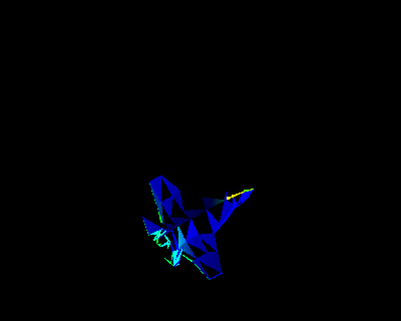
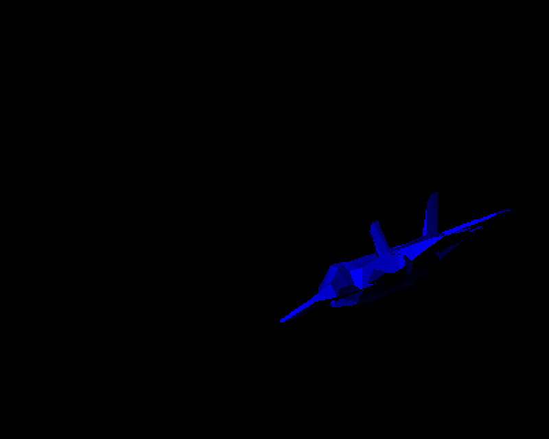
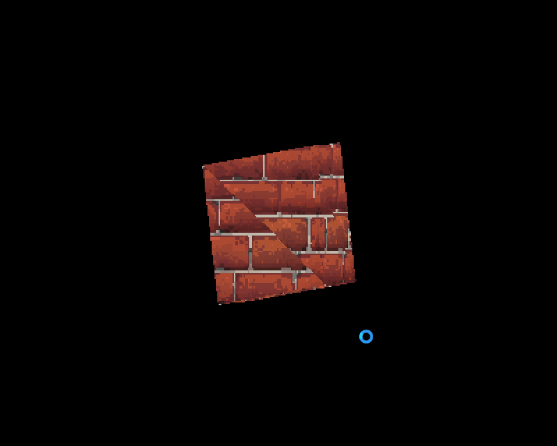

# Rust 3D polygons engine :) (for learning)

1. Work with the Phong model shader
2. Work only with wavefront obj files
3. Don't use directly OpenGL, Vulkan or others 3D libraries
----------------------
## TODO :D
----------------------
- [x] Drawing a cube
- [ ] Load Wavefront files
    - [ ] Loading all data
    - [x] Ambient, diffuse, diffuse
    - [x] Vertices
    - [x] Normals
    - [ ] Textures
        - [x] Texture image
        - [x] Texture Coordinates
        - [ ] Understand how to match both

- [ ] Shading with Phong model
    - [ ] Textures
        - [x] Draw texture on cube
        - [ ] Draw it correctly 
        - [ ] Understand how to draw it correctly

    - [x] Ambient, diffuse, specular
    
- [ ] ~~Using GPU instead of CPU~~
- [ ] Moving through the world
----------------------

| First shader | Specular shading |
| ----------------- | -------------------- |
|  |  |

| Airplane failed test | Airplane test success |
| --------------------- | ---------------- |
|  |  |

| Failed texture mapping | 
| ---------------------- |
|  |
