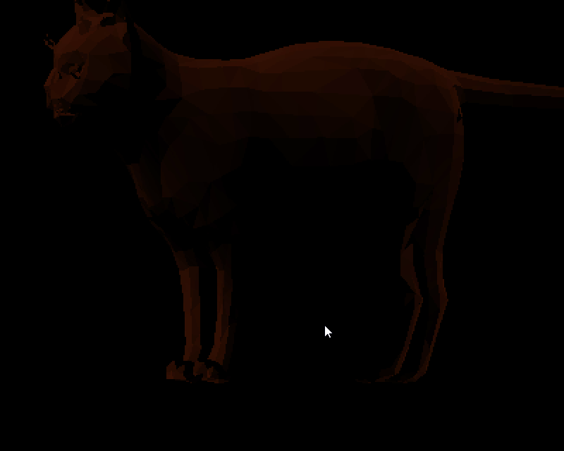

# Rust 3D polygons engine :)

1. Work with the Phong model shader
2. Only with wavefront obj files
3. Don't use directly OpenGL, Vulkan or others 3D libraries
----------------------
## TODO :D
----------------------
- [x] Drawing a cube
- [x] Load Wavefront files
- [x] Shading with Phong model
- [ ] Using GPU instead of CPU
- [ ] Moving through the world
- [ ] Texture mapping
----------------------

| First shader | Specular shading |
| ----------------- | -------------------- |
|  |  |

| Airplane failed test | Cat test success |
| --------------------- | ---------------- |
|  |  |
